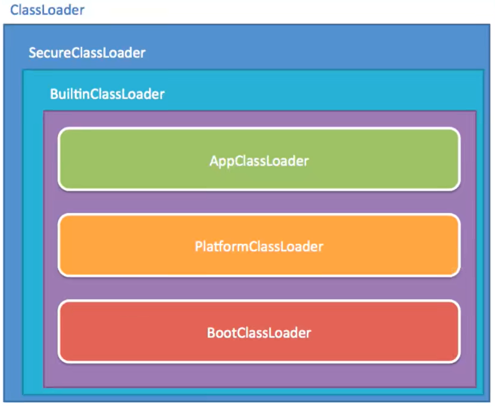
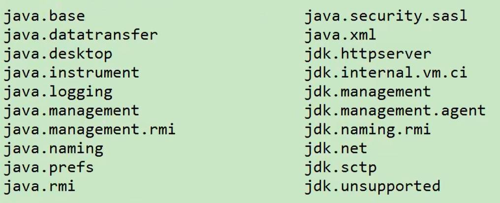
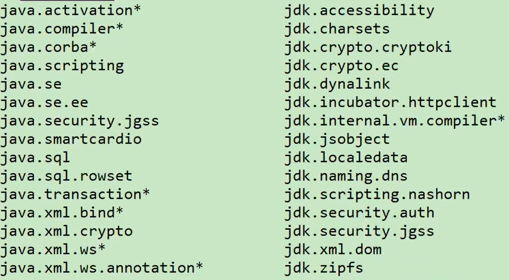
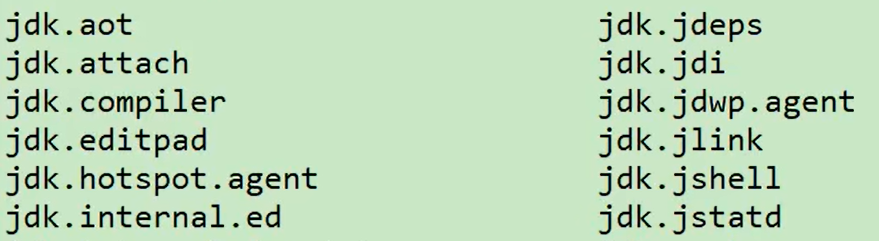

为了保证兼容性，JDK 9 没有从根本上改变三层类加载器架构和双亲委派模型，但为了模块化系统的顺利运行，仍然发生了一些值得被注意的变动

1. 扩展机制被移除，扩展类加载器由于向后兼容性的原因被保留，不过被重命名为平台类加载器（Platform Class Loader）。可以通过 ClassLoader 的新方法 getPlatformClassLoader() 来获取。

   JDK 9 时基于模块化进行构建（原来的 rt.jar 和 tools.jar 被拆分成数十个 JMOD 文件），其中的 Java 类库就已天然地满足了可扩展的需求，那自然无需再保留 <JAVA_HOME>\lib\ext 目录，此前使用这个目录或者 java.ext.dirs 系统变量来扩展 JDK 功能的机制已经没有继续存在的价值了。

2. 平台类加载器和应用程序类加载器都不再继承自 java.net.URLClassLoader

   现在启动类加载器、平台类加载器、应用程序类加载器全都继承于 jdk.internal.loader.BuiltinClassLoader。

  

如果有程序直接依赖了这种继承关系，或者依赖了URLClassLoader类的特定方法，那代码很可能会在JDK9及更高版本的JDK中崩溃。

3. 在Java9中，类加载器有了名称。该名称在构造方法中指定，可以通过getName()方法来获取。平台类加载器的名称是platform，应用类加载器的名称是app。类加载器的名称在调试与类加载器相关的问题时会非常有用。

4. 启动类加载器现在是在jvm内部和java类库共同协作实现的类加载器（以前是C++实现），但为了与之前代码兼容，在获取启动类加载器的场景中仍然会返回null，而不会得到BootClassLoader实例。

5. 类加载的委派关系也发生了变动。当平台及应用程序类加载器收到类加载请求，在委派给父加载器加载前，要先判断该类是否能够归属到某一个系统模块中，如果可以找到这样的归属关系，就要优先委派给负责那个模块的加载器完成加载。

   

在 Java 模块化系统明确规定了三个类加载器负责各自加载的模块：

## 启动类加载器

## 平台类加载器

## 应用程序类加载器

... 