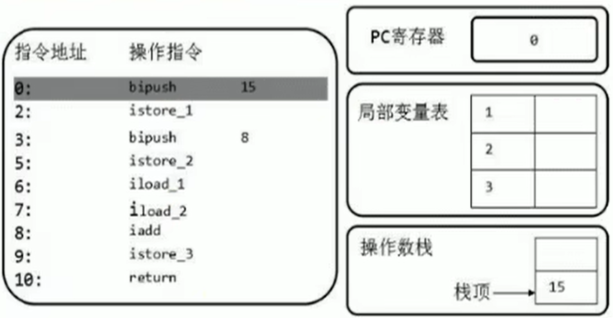
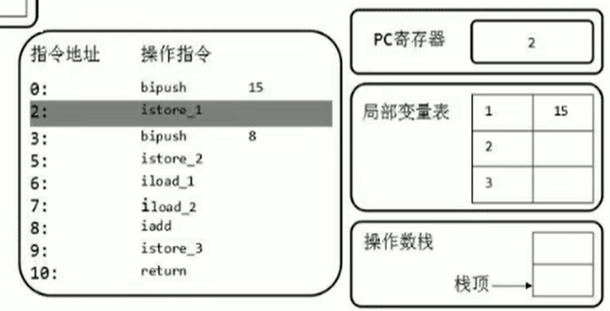
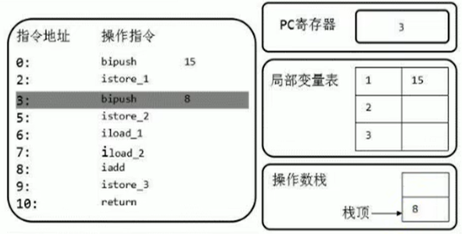
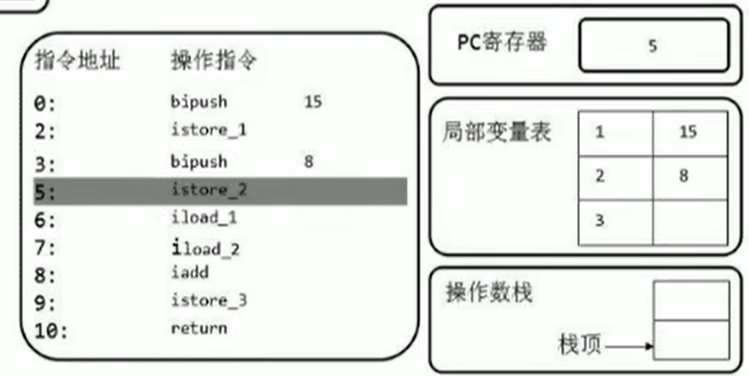
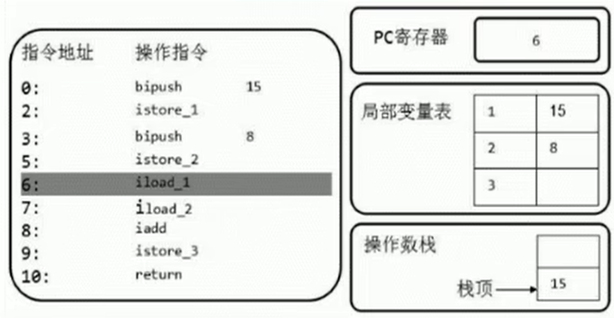
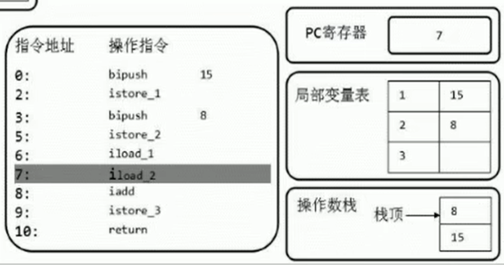
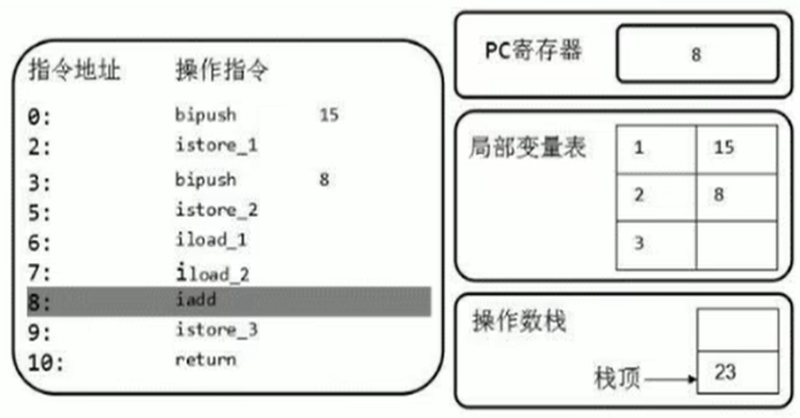
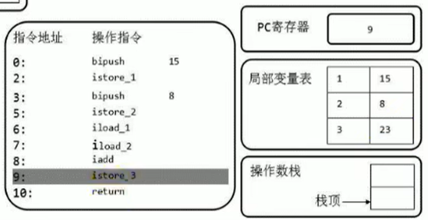

## 概念

* 操作数栈是由数组实现的

* 每一个独立的栈帧除了包含局部变量表以外，还包含一个<font color="orange">后进先出（Last-In-First-Out）</font>的操作数栈，也可以称之为表达式栈（Expression Stack）

* <font color="orange">操作数栈，在方法执行过程中，根据字节码指令，往栈中写入数据或提取数据，即入栈（push）和 出栈（pop）</font>

  * 某些字节码指令将值压入操作数栈，其余的字节码指令将操作数取出栈。使用它们后再把结果压入栈
  * 比如：执行复制、交换、求和等操作

  


* 操作数栈，<font color="orange">主要用于保存计算过程的中间结果，同时作为计算过程中变量临时的存储空间。</font>

* 操作数栈就是JVM执行引擎的一个工作区，当一个方法刚开始执行的时候，一个新的栈帧也会随之被创建出来，<font color="orange">这个方法的操作数栈是空的。</font>

* 每一个操作数栈都会拥有一个明确的栈深度用于存储数值，其所需的最大深度在编译期就定义好了，保存在方法的Code属性中，为max_stack的值。

* 栈中的任何一个元素都是可以任意的Java数据类型

  * 32bit的类型占用一个栈单位深度
  * 64bit的类型占用两个栈单位深度

* 操作数栈<font color="orange">并非采用访问索引的方式来进行数据访问</font>的，而是只能通过<font color="orange">标准的入栈(push)和出栈(pop)操作</font>来完成一次数据访问

* <font color="orange">如果被调用的方法带有返回值的话，其返回值将会被压入当前栈帧的操作数栈中</font>，并更新PC寄存器中下一条需要执行的字节码指令。

* 操作数栈中元素的数据类型必须与字节码指令的序列严格匹配，这由编译器在编译器期间进行验证，同时在类加载过程中的类检验阶段的数据流分析阶段要再次验证。

* 另外，我们说Java虚拟机的<font color="orange">解释引擎是基于栈的执行引擎</font>，其中的栈指的就是操作数栈。

  

## 演示

```java
public class Test {
    public void testAddOperation() {
        byte i = 15;
        int j = 8;
        int k = i + j;
    }
}
// -------------------- 字节码 --------------------
 0 bipush 15	
 2 istore_1
 3 bipush 8		
 5 istore_2
 6 iload_1
 7 iload_2
 8 iadd
 9 istore_3
10 return
```

 

将15取出来，然后存在操作数栈中

 

然后将15转存到局部变量表中，istore_1的1代表的是局部变量表中索引为1的位置
注意，这里为什么存储1的位置？因为0的位置是this

 

将8取出来，然后存在操作数栈中

 

然后将15转存到局部变量表中

 

 

2个iload，前面的i代表的是int型，在slot已经解释过了，byte，int，short，char都会保存成int型
后面的load代表的是将局部变量表中的1和2取出来放到操作数栈中

 

iadd，将这2个数出栈，执行引擎将翻译成机器语言，做执行，结果放回到操作数栈中

 

最后再将操作数栈中的结果放到局部变量表中

 

可以看到，操作数栈的最大深度是2


### 小知识1

```java
int a = 10;
// -------------------- 字节码 --------------------
0 bipush 10
```

```java
int a = 200;
// -------------------- 字节码 --------------------
0 sipush 200
```

### 小知识2

```java
public void testGetSum() {
    int i = getSum();
    int j = 10;
}
// -------------------- 字节码 --------------------
0 aload_0 //可以看到一上来就取数据去了
1 invokevirtual #2 <com/cloud/Test.getSum : ()I>
4 istore_1
5 bipush 10
7 istore_2
8 return
```


## 栈顶缓存技术

前面提过，基于栈式架构的虚拟机所使用的零地址指令更加紧凑，但完成一项操作的时候必然需要使用更多的入栈和出栈指令，这同时也就意味着将需要更多的指令分派（instruction dispatch）次数和内存读/写次数。

由于操作数是存储在内存中的，因此频繁地执行内存读/写操作必然会影响执行速度。为了解决这个问题，HotSpot JVM的设计者们提出了栈顶缓存（Tos，Top-of-Stack Cashing）技术，**将栈顶元素全部缓存在物理CPU的寄存器中，以此降低对内存的读/写次数，提升执行引擎的执行效率。**