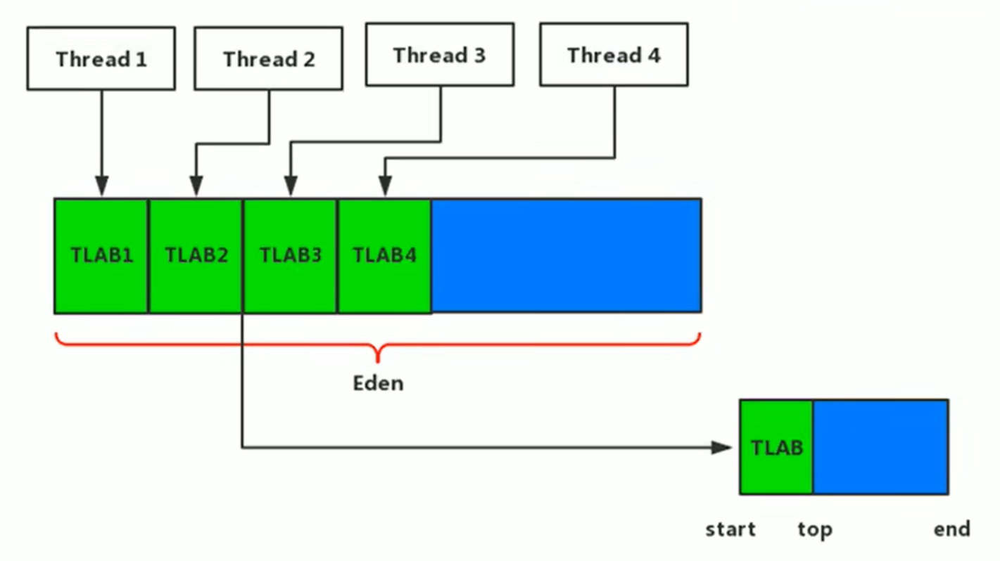

## 为什么有TLAB

- 堆区是线程共享区域，任何线程都可以访问到堆区中的共享数据 

-  由于对象实例的创建在JVM中非常频繁，因此在并发环境下从堆区中划分内存空间是线程不安全的 

-  为避免多个线程操作同一地址，需要使用加锁等机制，进而影响分配速度。 

## 什么是TLAB

*  从内存模型而不是垃圾收集的角度，对Eden区域继续进行划分，JVM为每个线程分配了一个私有缓存区域，它包含在Eden空间内。 
* 多线程同时分配内存时，使用TLAB可以避免一系列的非线程安全问题，同时还能够提升内存分配的吞吐量，因此我们可以将这种内存分配方式称之为快速分配策略。 
* 据我所知所有OpenJDK衍生出来的JVM都提供了TLAB的设计。 

## TLAB小结

- 尽管不是所有的对象实例都能够在TLAB中成功分配内存，但JVM确实是将TLAB作为内存分配的首选。 

-  在程序中，开发人员可以通过选项“`-XX:UseTLAB`”设置是否开启TLAB空间。 【默认开启】

-  默认情况下，TLAB空间的内存非常小，仅占有整个Eden空间的1%，当然我们可以通过选项 “`-XX:TLABWasteTargetPercent`” 设置TLAB空间所占用Eden空间的百分比大小。 

-  一旦对象在TLAB空间分配内存失败时，JVM就会尝试着通过使用加锁机制确保数据操作的原子性，从而直接在Eden空间中分配内存。 

当类加载之后，会优先去找TLAB的区域进行分配，如果TLAB大小不够，才会去找公共的Eden去分配