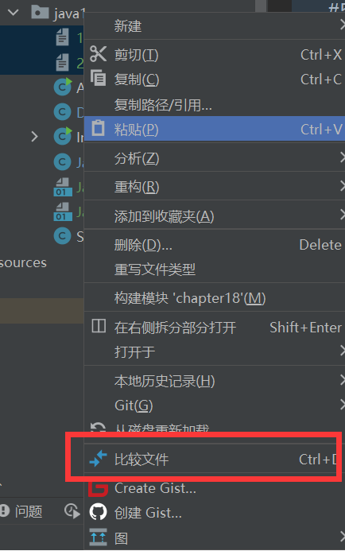
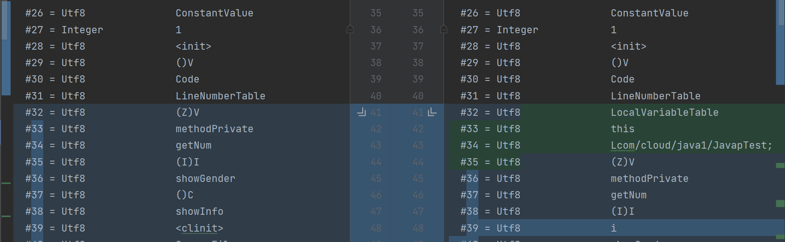

## 例子

```java
public class JavapTest {
    private int num;
    boolean flag;
    protected char gender;
    public String info;

    public static final int COUNTS = 1;
    static{
        String url = "www.cloud.com";
    }
    {
        info = "java";
    }
    public JavapTest(){

    }
    private JavapTest(boolean flag){
        this.flag = flag;
    }
    private void methodPrivate(){

    }
    int getNum(int i){
        return num + i;
    }
    protected char showGender(){
        return gender;
    }
    public void showInfo(){
        int i = 10;
        System.out.println(info + i);
    }
}
```

我们用javac和javac -g进行编译

```shell
javac JavapTest.java
javac -g JavapTest.java
```

然后都反编译，将反编译的内容写入到txt文件中

```java
javap -v JavapTest1.class > 1.txt
javap -v JavapTest2.class > 2.txt
```

同时选中2个txt文件，右键比较文件

 



可以看到多出了局部变量表


## IDE

使用idea会用javac -g，会带局部变量表