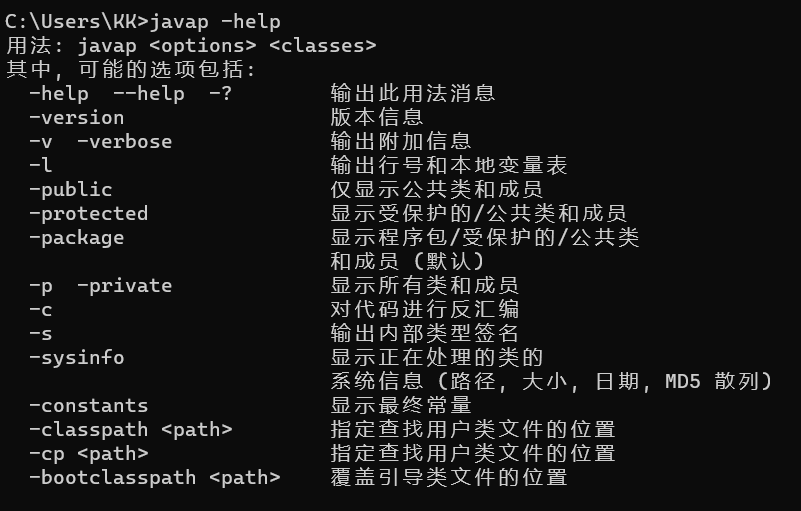

## 测试用例

```java
public class JavapTest {
    private int num;
    boolean flag;
    protected char gender;
    public String info;

    public static final int COUNTS = 1;
    static{
        String url = "www.cloud.com";
    }
    {
        info = "java";
    }
    public JavapTest(){

    }
    private JavapTest(boolean flag){
        this.flag = flag;
    }
    private void methodPrivate(){

    }
    int getNum(int i){
        return num + i;
    }
    protected char showGender(){
        return gender;
    }
    public void showInfo(){
        int i = 10;
        System.out.println(info + i);
    }
}
```

## javap的用法

javap 的用法格式：javap

其中，classes 就是你要反编译的 Class 文件。

在命令行中直接输入 javap 或 javap -help 可以看到 javap 的 options 有如下选项：



## 查看java的版本

使用javap，那肯定也是要java版本的，这个和java -version是一样的

```java
C:\Users\KK>javap -version
1.8.0_302
```


## 仅显示公共类和成员

可以看到，所有被public修饰的方法和成员都出来了

```shell
PS D:\study\JVM\chapter18\src\main\java\com\cloud\java1> javap -public JavapTest2.class
Compiled from "JavapTest.java"
public class com.cloud.java1.JavapTest {
  public java.lang.String info;
  public static final int COUNTS;
  public com.cloud.java1.JavapTest();
  public void showInfo();
}
```

## 仅显示受保护的、公共的类和成员

这个不仅仅显示protected，public也会显示出来

```java
PS D:\study\JVM\chapter18\src\main\java\com\cloud\java1> javap -protected JavapTest2.class
Compiled from "JavapTest.java"
public class com.cloud.java1.JavapTest {
  protected char gender;
  public java.lang.String info;
  public static final int COUNTS;
  public com.cloud.java1.JavapTest();
  protected char showGender();
  public void showInfo();
}

```


## 显示所有的类和成员

这个p就是private，显示出private以上的所有类和成员

```java
PS D:\study\JVM\chapter18\src\main\java\com\cloud\java1> javap -p JavapTest2.class
Compiled from "JavapTest.java"
public class com.cloud.java1.JavapTest {
  private int num;
  boolean flag;
  protected char gender;
  public java.lang.String info;
  public static final int COUNTS;
  public com.cloud.java1.JavapTest();
  private com.cloud.java1.JavapTest(boolean);
  private void methodPrivate();
  int getNum(int);
  protected char showGender();
  public void showInfo();
  static {};
}
```


## 显示非私有信息

```java
PS D:\study\JVM\chapter18\src\main\java\com\cloud\java1> javap -package JavapTest2.class
Compiled from "JavapTest.java"
public class com.cloud.java1.JavapTest {
  boolean flag;
  protected char gender;
  public java.lang.String info;
  public static final int COUNTS;
  public com.cloud.java1.JavapTest();
  int getNum(int);
  protected char showGender();
  public void showInfo();
  static {};
}

```


## 显示类的系统信息

```java
PS D:\study\JVM\chapter18\src\main\java\com\cloud\java1> javap -sysinfo JavapTest2.class
Classfile /D:/study/JVM/chapter18/src/main/java/com/cloud/java1/JavapTest2.class
  Last modified 2023-5-7; size 1352 bytes
  MD5 checksum 6cafb3674aecf62929ee5536a38ca971
  Compiled from "JavapTest.java"
public class com.cloud.java1.JavapTest {
  boolean flag;
  protected char gender;
  public java.lang.String info;
  public static final int COUNTS;
  public com.cloud.java1.JavapTest();
  int getNum(int);
  protected char showGender();
  public void showInfo();
  static {};
}

```


## 显示常量

看COUNTS，会显示出来

```java
PS D:\study\JVM\chapter18\src\main\java\com\cloud\java1> javap -constants JavapTest2.class
Compiled from "JavapTest.java"
public class com.cloud.java1.JavapTest {
  boolean flag;
  protected char gender;
  public java.lang.String info;
  public static final int COUNTS = 1;
  public com.cloud.java1.JavapTest();
  int getNum(int);
  protected char showGender();
  public void showInfo();
  static {};
}
```


## 输出内部类型签名

可以看到类型描述符

```java
PS D:\study\JVM\chapter18\src\main\java\com\cloud\java1> javap -s JavapTest2.class
Compiled from "JavapTest.java"
public class com.cloud.java1.JavapTest {
  boolean flag;
    descriptor: Z
  protected char gender;
    descriptor: C
  public java.lang.String info;
    descriptor: Ljava/lang/String;
  public static final int COUNTS;
    descriptor: I
  public com.cloud.java1.JavapTest();
    descriptor: ()V

  int getNum(int);
    descriptor: (I)I

  protected char showGender();
    descriptor: ()C

  public void showInfo();
    descriptor: ()V

  static {};
    descriptor: ()V
}

```

但是上面并不带私有的信息，我们可以用-s -p，这样私有的也有了

```java
PS D:\study\JVM\chapter18\src\main\java\com\cloud\java1> javap -s -p JavapTest2.class
Compiled from "JavapTest.java"
public class com.cloud.java1.JavapTest {
  private int num;
    descriptor: I
  boolean flag;
    descriptor: Z
  protected char gender;
    descriptor: C
  public java.lang.String info;
    descriptor: Ljava/lang/String;
  public static final int COUNTS;
    descriptor: I
  public com.cloud.java1.JavapTest();
    descriptor: ()V

  private com.cloud.java1.JavapTest(boolean);
    descriptor: (Z)V

  private void methodPrivate();
    descriptor: ()V

  int getNum(int);
    descriptor: (I)I

  protected char showGender();
    descriptor: ()C

  public void showInfo();
    descriptor: ()V

  static {};
    descriptor: ()V
}

```


## 输出行号和局部变量表

必须要javac -g生成的class，如果没有-g，那么只有行号，没有局部变量表

```java
PS D:\study\JVM\chapter18\src\main\java\com\cloud\java1> javap -l JavapTest2.class
Compiled from "JavapTest.java"
public class com.cloud.java1.JavapTest {
  boolean flag;

  protected char gender;

  public java.lang.String info;

  public static final int COUNTS;

  public com.cloud.java1.JavapTest();
    LineNumberTable:
      line 20: 0
      line 18: 4
      line 22: 10
    LocalVariableTable:
      Start  Length  Slot  Name   Signature
          0      11     0  this   Lcom/cloud/java1/JavapTest;

  int getNum(int);
    LineNumberTable:
      line 30: 0
    LocalVariableTable:
      Start  Length  Slot  Name   Signature
          0       7     0  this   Lcom/cloud/java1/JavapTest;
          0       7     1     i   I

  protected char showGender();
    LineNumberTable:
      line 33: 0
    LocalVariableTable:
      Start  Length  Slot  Name   Signature
          0       5     0  this   Lcom/cloud/java1/JavapTest;

  public void showInfo();
    LineNumberTable:
      line 36: 0
      line 37: 3
      line 38: 30
    LocalVariableTable:
      Start  Length  Slot  Name   Signature
          0      31     0  this   Lcom/cloud/java1/JavapTest;
          3      28     1     i   I

  static {};
    LineNumberTable:
      line 15: 0
      line 16: 3
    LocalVariableTable:
      Start  Length  Slot  Name   Signature
}

```


## 对代码进行反编译

```java
PS D:\study\JVM\chapter18\src\main\java\com\cloud\java1> javap -c JavapTest2.class
Compiled from "JavapTest.java"
public class com.cloud.java1.JavapTest {
  boolean flag;

  protected char gender;

  public java.lang.String info;

  public static final int COUNTS;

  public com.cloud.java1.JavapTest();
    Code:
       0: aload_0
       1: invokespecial #1                  // Method java/lang/Object."<init>":()V
       4: aload_0
       5: ldc           #2                  // String java
       7: putfield      #3                  // Field info:Ljava/lang/String;
      10: return

  int getNum(int);
    Code:
       0: aload_0
       1: getfield      #5                  // Field num:I
       4: iload_1
       5: iadd
       6: ireturn

  protected char showGender();
    Code:
       0: aload_0
       1: getfield      #6                  // Field gender:C
       4: ireturn

  public void showInfo();
    Code:
       0: bipush        10
       2: istore_1
       3: getstatic     #7                  // Field java/lang/System.out:Ljava/io/PrintStream;
       6: new           #8                  // class java/lang/StringBuilder
       9: dup
      10: invokespecial #9                  // Method java/lang/StringBuilder."<init>":()V
      13: aload_0
      14: getfield      #3                  // Field info:Ljava/lang/String;
      17: invokevirtual #10                 // Method java/lang/StringBuilder.append:(Ljava/lang/String;)Ljava/lang/StringBuilder;
      20: iload_1
      21: invokevirtual #11                 // Method java/lang/StringBuilder.append:(I)Ljava/lang/StringBuilder;
      24: invokevirtual #12                 // Method java/lang/StringBuilder.toString:()Ljava/lang/String;
      27: invokevirtual #13                 // Method java/io/PrintStream.println:(Ljava/lang/String;)V
      30: return

  static {};
    Code:
       0: ldc           #14                 // String www.cloud.com
       2: astore_0
       3: return
}
```


## 反编译并且输出详细信息

可以看到，常量池都给你干出来了，这个v是verbose
但是并不包含私有属性，你可以-v -p

```java
PS D:\study\JVM\chapter18\src\main\java\com\cloud\java1> javap -v JavapTest2.class
Classfile /D:/study/JVM/chapter18/src/main/java/com/cloud/java1/JavapTest2.class
  Last modified 2023-5-7; size 1352 bytes
  MD5 checksum 6cafb3674aecf62929ee5536a38ca971
  Compiled from "JavapTest.java"
public class com.cloud.java1.JavapTest
  minor version: 0
  major version: 52
  flags: ACC_PUBLIC, ACC_SUPER
Constant pool:
   #1 = Methodref          #16.#46        // java/lang/Object."<init>":()V
   #2 = String             #47            // java
   #3 = Fieldref           #15.#48        // com/cloud/java1/JavapTest.info:Ljava/lang/String;
   #4 = Fieldref           #15.#49        // com/cloud/java1/JavapTest.flag:Z
   #5 = Fieldref           #15.#50        // com/cloud/java1/JavapTest.num:I
   #6 = Fieldref           #15.#51        // com/cloud/java1/JavapTest.gender:C
   #7 = Fieldref           #52.#53        // java/lang/System.out:Ljava/io/PrintStream;
   #8 = Class              #54            // java/lang/StringBuilder
   #9 = Methodref          #8.#46         // java/lang/StringBuilder."<init>":()V
  #10 = Methodref          #8.#55         // java/lang/StringBuilder.append:(Ljava/lang/String;)Ljava/lang/StringBuilder;
  #11 = Methodref          #8.#56         // java/lang/StringBuilder.append:(I)Ljava/lang/StringBuilder;
  #12 = Methodref          #8.#57         // java/lang/StringBuilder.toString:()Ljava/lang/String;
  #13 = Methodref          #58.#59        // java/io/PrintStream.println:(Ljava/lang/String;)V
  #14 = String             #60            // www.cloud.com
  #15 = Class              #61            // com/cloud/java1/JavapTest
  #16 = Class              #62            // java/lang/Object
  #17 = Utf8               num
  #18 = Utf8               I
  #19 = Utf8               flag
  #20 = Utf8               Z
  #21 = Utf8               gender
  #22 = Utf8               C
  #23 = Utf8               info
  #24 = Utf8               Ljava/lang/String;
  #25 = Utf8               COUNTS
  #26 = Utf8               ConstantValue
  #27 = Integer            1
  #28 = Utf8               <init>
  #29 = Utf8               ()V
  #30 = Utf8               Code
  #31 = Utf8               LineNumberTable
  #32 = Utf8               LocalVariableTable
  #33 = Utf8               this
  #34 = Utf8               Lcom/cloud/java1/JavapTest;
  #35 = Utf8               (Z)V
  #36 = Utf8               methodPrivate
  #37 = Utf8               getNum
  #38 = Utf8               (I)I
  #39 = Utf8               i
  #40 = Utf8               showGender
  #41 = Utf8               ()C
  #42 = Utf8               showInfo
  #43 = Utf8               <clinit>
  #44 = Utf8               SourceFile
  #45 = Utf8               JavapTest.java
  #46 = NameAndType        #28:#29        // "<init>":()V
  #47 = Utf8               java
  #48 = NameAndType        #23:#24        // info:Ljava/lang/String;
  #49 = NameAndType        #19:#20        // flag:Z
  #50 = NameAndType        #17:#18        // num:I
  #51 = NameAndType        #21:#22        // gender:C
  #52 = Class              #63            // java/lang/System
  #53 = NameAndType        #64:#65        // out:Ljava/io/PrintStream;
  #54 = Utf8               java/lang/StringBuilder
  #55 = NameAndType        #66:#67        // append:(Ljava/lang/String;)Ljava/lang/StringBuilder;
  #56 = NameAndType        #66:#68        // append:(I)Ljava/lang/StringBuilder;
  #57 = NameAndType        #69:#70        // toString:()Ljava/lang/String;
  #58 = Class              #71            // java/io/PrintStream
  #59 = NameAndType        #72:#73        // println:(Ljava/lang/String;)V
  #60 = Utf8               www.cloud.com
  #61 = Utf8               com/cloud/java1/JavapTest
  #62 = Utf8               java/lang/Object
  #63 = Utf8               java/lang/System
  #64 = Utf8               out
  #65 = Utf8               Ljava/io/PrintStream;
  #66 = Utf8               append
  #67 = Utf8               (Ljava/lang/String;)Ljava/lang/StringBuilder;
  #68 = Utf8               (I)Ljava/lang/StringBuilder;
  #69 = Utf8               toString
  #70 = Utf8               ()Ljava/lang/String;
  #71 = Utf8               java/io/PrintStream
  #72 = Utf8               println
  #73 = Utf8               (Ljava/lang/String;)V
{
  boolean flag;
    descriptor: Z
    flags:

  protected char gender;
    descriptor: C
    flags: ACC_PROTECTED

  public java.lang.String info;
    descriptor: Ljava/lang/String;
    flags: ACC_PUBLIC

  public static final int COUNTS;
    descriptor: I
    flags: ACC_PUBLIC, ACC_STATIC, ACC_FINAL
    ConstantValue: int 1

  public com.cloud.java1.JavapTest();
    descriptor: ()V
    flags: ACC_PUBLIC
    Code:
      stack=2, locals=1, args_size=1
         0: aload_0
         1: invokespecial #1                  // Method java/lang/Object."<init>":()V
         4: aload_0
         5: ldc           #2                  // String java
         7: putfield      #3                  // Field info:Ljava/lang/String;
        10: return
      LineNumberTable:
        line 20: 0
        line 18: 4
        line 22: 10
      LocalVariableTable:
        Start  Length  Slot  Name   Signature
            0      11     0  this   Lcom/cloud/java1/JavapTest;

  int getNum(int);
    descriptor: (I)I
    flags:
    Code:
      stack=2, locals=2, args_size=2
         0: aload_0
         1: getfield      #5                  // Field num:I
         4: iload_1
         5: iadd
         6: ireturn
      LineNumberTable:
        line 30: 0
      LocalVariableTable:
        Start  Length  Slot  Name   Signature
            0       7     0  this   Lcom/cloud/java1/JavapTest;
            0       7     1     i   I

  protected char showGender();
    descriptor: ()C
    flags: ACC_PROTECTED
    Code:
      stack=1, locals=1, args_size=1
         0: aload_0
         1: getfield      #6                  // Field gender:C
         4: ireturn
      LineNumberTable:
        line 33: 0
      LocalVariableTable:
        Start  Length  Slot  Name   Signature
            0       5     0  this   Lcom/cloud/java1/JavapTest;

  public void showInfo();
    descriptor: ()V
    flags: ACC_PUBLIC
    Code:
      stack=3, locals=2, args_size=1
         0: bipush        10
         2: istore_1
         3: getstatic     #7                  // Field java/lang/System.out:Ljava/io/PrintStream;
         6: new           #8                  // class java/lang/StringBuilder
         9: dup
        10: invokespecial #9                  // Method java/lang/StringBuilder."<init>":()V
        13: aload_0
        14: getfield      #3                  // Field info:Ljava/lang/String;
        17: invokevirtual #10                 // Method java/lang/StringBuilder.append:(Ljava/lang/String;)Ljava/lang/StringBuilder;
        20: iload_1
        21: invokevirtual #11                 // Method java/lang/StringBuilder.append:(I)Ljava/lang/StringBuilder;
        24: invokevirtual #12                 // Method java/lang/StringBuilder.toString:()Ljava/lang/String;
        27: invokevirtual #13                 // Method java/io/PrintStream.println:(Ljava/lang/String;)V
        30: return
      LineNumberTable:
        line 36: 0
        line 37: 3
        line 38: 30
      LocalVariableTable:
        Start  Length  Slot  Name   Signature
            0      31     0  this   Lcom/cloud/java1/JavapTest;
            3      28     1     i   I

  static {};
    descriptor: ()V
    flags: ACC_STATIC
    Code:
      stack=1, locals=1, args_size=0
         0: ldc           #14                 // String www.cloud.com
         2: astore_0
         3: return
      LineNumberTable:
        line 15: 0
        line 16: 3
      LocalVariableTable:
        Start  Length  Slot  Name   Signature
}
SourceFile: "JavapTest.java"

```


## 解读

```java
PS D:\study\JVM\chapter18\src\main\java\com\cloud\java1> javap -v JavapTest2.class
Classfile /D:/study/JVM/chapter18/src/main/java/com/cloud/java1/JavapTest2.class  // 字节码文件的所属路径
  Last modified 2023-5-7; size 1352 bytes                 // 最后修改时间，字节码文件的大小
  MD5 checksum 6cafb3674aecf62929ee5536a38ca971			 // DM5散列值
  Compiled from "JavapTest.java"                          // java源文件
public class com.cloud.java1.JavapTest                    
  minor version: 0  		// 副版本
  major version: 52 		// 主版本
  flags: ACC_PUBLIC, ACC_SUPER	// 当前类的访问标识
Constant pool:   			// 常量池
   #1 = Methodref          #16.#46        // java/lang/Object."<init>":()V
   #2 = String             #47            // java
   #3 = Fieldref           #15.#48        // com/cloud/java1/JavapTest.info:Ljava/lang/String;
   #4 = Fieldref           #15.#49        // com/cloud/java1/JavapTest.flag:Z
   #5 = Fieldref           #15.#50        // com/cloud/java1/JavapTest.num:I
   #6 = Fieldref           #15.#51        // com/cloud/java1/JavapTest.gender:C
   #7 = Fieldref           #52.#53        // java/lang/System.out:Ljava/io/PrintStream;
   #8 = Class              #54            // java/lang/StringBuilder
   #9 = Methodref          #8.#46         // java/lang/StringBuilder."<init>":()V
  #10 = Methodref          #8.#55         // java/lang/StringBuilder.append:(Ljava/lang/String;)Ljava/lang/StringBuilder;
  #11 = Methodref          #8.#56         // java/lang/StringBuilder.append:(I)Ljava/lang/StringBuilder;
  #12 = Methodref          #8.#57         // java/lang/StringBuilder.toString:()Ljava/lang/String;
  #13 = Methodref          #58.#59        // java/io/PrintStream.println:(Ljava/lang/String;)V
  #14 = String             #60            // www.cloud.com
  #15 = Class              #61            // com/cloud/java1/JavapTest
  #16 = Class              #62            // java/lang/Object
  #17 = Utf8               num
  #18 = Utf8               I
  #19 = Utf8               flag
  #20 = Utf8               Z
  #21 = Utf8               gender
  #22 = Utf8               C
  #23 = Utf8               info
  #24 = Utf8               Ljava/lang/String;
  #25 = Utf8               COUNTS
  #26 = Utf8               ConstantValue
  #27 = Integer            1
  #28 = Utf8               <init>
  #29 = Utf8               ()V
  #30 = Utf8               Code
  #31 = Utf8               LineNumberTable
  #32 = Utf8               LocalVariableTable
  #33 = Utf8               this
  #34 = Utf8               Lcom/cloud/java1/JavapTest;
  #35 = Utf8               (Z)V
  #36 = Utf8               methodPrivate
  #37 = Utf8               getNum
  #38 = Utf8               (I)I
  #39 = Utf8               i
  #40 = Utf8               showGender
  #41 = Utf8               ()C
  #42 = Utf8               showInfo
  #43 = Utf8               <clinit>
  #44 = Utf8               SourceFile
  #45 = Utf8               JavapTest.java
  #46 = NameAndType        #28:#29        // "<init>":()V
  #47 = Utf8               java
  #48 = NameAndType        #23:#24        // info:Ljava/lang/String;
  #49 = NameAndType        #19:#20        // flag:Z
  #50 = NameAndType        #17:#18        // num:I
  #51 = NameAndType        #21:#22        // gender:C
  #52 = Class              #63            // java/lang/System
  #53 = NameAndType        #64:#65        // out:Ljava/io/PrintStream;
  #54 = Utf8               java/lang/StringBuilder
  #55 = NameAndType        #66:#67        // append:(Ljava/lang/String;)Ljava/lang/StringBuilder;
  #56 = NameAndType        #66:#68        // append:(I)Ljava/lang/StringBuilder;
  #57 = NameAndType        #69:#70        // toString:()Ljava/lang/String;
  #58 = Class              #71            // java/io/PrintStream
  #59 = NameAndType        #72:#73        // println:(Ljava/lang/String;)V
  #60 = Utf8               www.cloud.com
  #61 = Utf8               com/cloud/java1/JavapTest
  #62 = Utf8               java/lang/Object
  #63 = Utf8               java/lang/System
  #64 = Utf8               out
  #65 = Utf8               Ljava/io/PrintStream;
  #66 = Utf8               append
  #67 = Utf8               (Ljava/lang/String;)Ljava/lang/StringBuilder;
  #68 = Utf8               (I)Ljava/lang/StringBuilder;
  #69 = Utf8               toString
  #70 = Utf8               ()Ljava/lang/String;
  #71 = Utf8               java/io/PrintStream
  #72 = Utf8               println
  #73 = Utf8               (Ljava/lang/String;)V
{						// 字段表集合
  boolean flag;       // 字段名
    descriptor: Z     // 字段描述符
    flags:            // 字段访问标识，像这个空的就是默认权限

  protected char gender;
    descriptor: C
    flags: ACC_PROTECTED

  public java.lang.String info;
    descriptor: Ljava/lang/String;
    flags: ACC_PUBLIC

  public static final int COUNTS;
    descriptor: I
    flags: ACC_PUBLIC, ACC_STATIC, ACC_FINAL
    ConstantValue: int 1     // 字段的属性，给常量默认赋值用的

  public com.cloud.java1.JavapTest();    // 构造器
    descriptor: ()V
    flags: ACC_PUBLIC
    Code:
      stack=2, locals=1, args_size=1
         0: aload_0
         1: invokespecial #1                  // Method java/lang/Object."<init>":()V
         4: aload_0
         5: ldc           #2                  // String java
         7: putfield      #3                  // Field info:Ljava/lang/String;
        10: return
      LineNumberTable:
        line 20: 0
        line 18: 4
        line 22: 10
      LocalVariableTable:
        Start  Length  Slot  Name   Signature
            0      11     0  this   Lcom/cloud/java1/JavapTest;

  int getNum(int);
    descriptor: (I)I
    flags:
    Code:
      stack=2, locals=2, args_size=2
         0: aload_0
         1: getfield      #5                  // Field num:I
         4: iload_1
         5: iadd
         6: ireturn
      LineNumberTable:
        line 30: 0
      LocalVariableTable:
        Start  Length  Slot  Name   Signature
            0       7     0  this   Lcom/cloud/java1/JavapTest;
            0       7     1     i   I

  protected char showGender();
    descriptor: ()C
    flags: ACC_PROTECTED
    Code:
      stack=1, locals=1, args_size=1
         0: aload_0
         1: getfield      #6                  // Field gender:C
         4: ireturn
      LineNumberTable:
        line 33: 0
      LocalVariableTable:
        Start  Length  Slot  Name   Signature
            0       5     0  this   Lcom/cloud/java1/JavapTest;

  public void showInfo();
    descriptor: ()V      // 方法描述符，方法的返回值类型
    flags: ACC_PUBLIC    // 方法的访问标识
    Code:                // 方法的code属性
      stack=3, locals=2, args_size=1     // 操作数栈最大值，局部变量表最大值，参数个数
     // 偏移量:操作码 操作数
         0: bipush        10
         2: istore_1
         3: getstatic     #7                  // Field java/lang/System.out:Ljava/io/PrintStream;
         6: new           #8                  // class java/lang/StringBuilder
         9: dup
        10: invokespecial #9                  // Method java/lang/StringBuilder."<init>":()V
        13: aload_0
        14: getfield      #3                  // Field info:Ljava/lang/String;
        17: invokevirtual #10                 // Method java/lang/StringBuilder.append:(Ljava/lang/String;)Ljava/lang/StringBuilder;
        20: iload_1
        21: invokevirtual #11                 // Method java/lang/StringBuilder.append:(I)Ljava/lang/StringBuilder;
        24: invokevirtual #12                 // Method java/lang/StringBuilder.toString:()Ljava/lang/String;
        27: invokevirtual #13                 // Method java/io/PrintStream.println:(Ljava/lang/String;)V
        30: return
      // 行号表，字节码偏移量和java源码中的行号对应关系
      LineNumberTable:
        line 36: 0
        line 37: 3
        line 38: 30
      // 局部变量表
      LocalVariableTable:
      // 作用域起始和长度 局部变量表的槽 局部变量名 局部变量的类型
        Start  Length  Slot  Name   Signature
            0      31     0  this   Lcom/cloud/java1/JavapTest;
            3      28     1     i   I

  static {};
    descriptor: ()V
    flags: ACC_STATIC
    Code:
      stack=1, locals=1, args_size=0
         0: ldc           #14                 // String www.cloud.com
         2: astore_0
         3: return
      LineNumberTable:
        line 15: 0
        line 16: 3
      LocalVariableTable:
        Start  Length  Slot  Name   Signature
}
SourceFile: "JavapTest.java"

```

